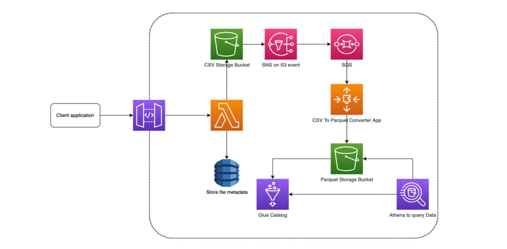

# Capstone 

## Architecture

1. **File Upload**: The user uploads a CSV file through a UI, which calls an API Gateway backed by IAM role authentication.
2. **Metadata Storage**: The file’s metadata is stored in DynamoDB.
3. **File Storage**: The file itself is stored in an S3 bucket.
4. **S3 Notification**: An S3 notification triggers an SNS topic, which sends a message to an SQS queue. Both the SNS topic and SQS queue are encrypted.
5. **CSV to Parquet Conversion**: An EC2 instance reads the S3 notification from the SQS queue and converts the CSV file to a Parquet file.
6. **Table Creation**: Terraform creates a table where the Parquet file is written.
7. **Querying**: The user can query the data using Athena.

-The project emphasizes secure and best coding practices, testing-driven development, and familiarity with various AWS services. It also requires the use of Git for source code management, Terraform for infrastructure as code, and Jenkins for continuous integration/continuous deployment. 